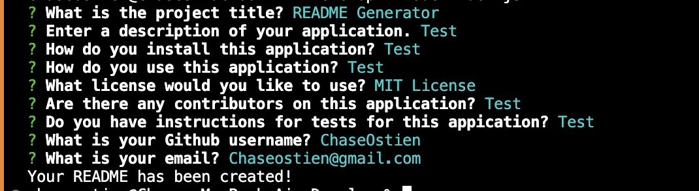

# README Generator 

  ## Table of Contents
  * [Description](#description)
  * [Installation](#installation)
  * [Usage](#usage)
  * [License](#license)
  * [Contributors](#contributors)
  * [Tests](#tests)
  * [Questions](#questions)

  ## Description
  This application will allow you to dynamically generate a README.md file for your application from a users input to prompts generated by the Inquirer package. A high quality README should include what the app is, how to use it, how to install it, how to contribute to it and how to make changes. 
  ## Installation
  To install this application, create a directory in which you will develop your application. Inititalize a `package.json` file by running `npm init -y`. You can then set up your git repo by running `git init` and creating a `.gitignore` file. You will include `node_modules` and `.DS_store` in your `.gitignore` to ensure they are not tracked or uploaded to GitHub. Ensure that your package.json file contains all of the required dependencies, including `inquirer: ^8.2.4`. After checking your dependencies, install inquirer version 8.2.4 by running `npm i inquirer@8.2.4`.
  ## Usage
  To use this application, make sure you have followed all installation instructions and installed inquirer version 8.2.4. Verify that your main JS file is listed under "main" in your `package.json` file. Navigate to the directory containing your main JS file and run it using the command `node (filename).js`. Answer the generated prompts and select a license. If you do not need a license for your application, select N/A. Once all prompts have been answered, your file will automatically be generated in your directory. You can then publish this file to your remote GitHub repository. 
  #### Example of command line prompts for this application.
  
  ## License
  MIT License

  https://opensource.org/licenses/MIT
  ## Contributors
  This application currently has no contributors other then myself, Chase Ostien. 
  ## Tests
  This application does not currently have any written tests. You can however, test the function of the application by initializing it and answering the prompts to generate a file. Once you have generated a file and have viewed the output, you can iterate on this in future generated files.

  ## Questions
  ### If you have any questions about this application, please send all correspondence to the contact info listed below. 
  * GitHub: Chase Ostien - https://github.com/ChaseOstien
  * Email: Chaseostien@gmail.com
